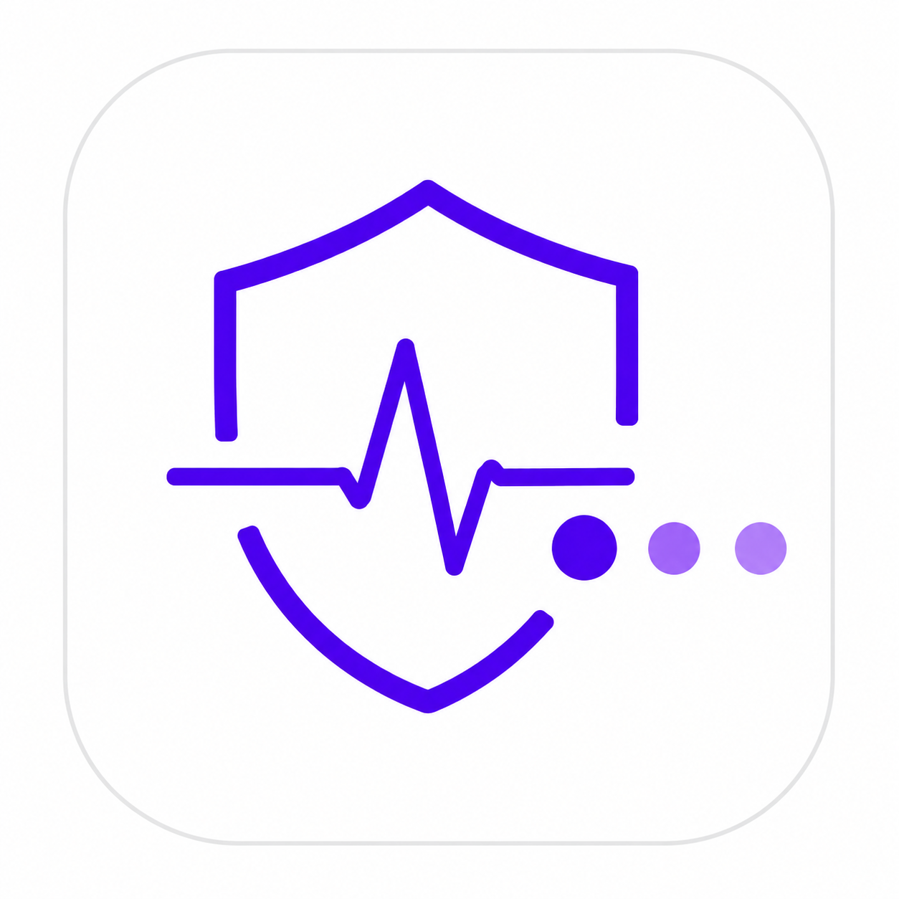
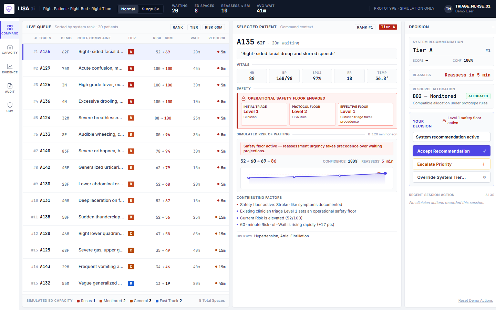

# LISA.ai

**Right Patient. Right Bed. Right Time.**

LISA.ai is a clinician-controlled Emergency Department sequencing prototype that prioritizes patients based on Risk-of-Wait and limited simulated ED capacity.

- **Live Demo:** [https://lisa-ai-7dtj.onrender.com/](https://lisa-ai-7dtj.onrender.com/)
- **Demo Video:** [VIDEO LINK](https://drive.google.com/file/d/1UEWLVu49-qT43U9LuL55V00FyKDNRmjW/view?usp=drive_link)

> **Prototype simulation only — not for clinical use.**


*LISA.ai Nurse Command Center*

---

## The Problem

Traditional emergency department triage primarily answers:
> *"How sick is this patient right now?"*

However, operational crowding requires answering:
> *"Which waiting patient may become more concerning if delayed?"*

Patients wait under changing clinical risk, incomplete information, scarce clinician attention, and limited bed capacity.

---

## The Solution

LISA.ai adds a deterministic Risk-of-Wait layer on top of initial clinician triage.

It combines protocol safety guardrails, current and projected Risk-of-Wait (Now, 30m, 60m, 120m), reassessment urgency, clinical uncertainty, queue competition, and simulated resource compatibility to recommend who should receive attention next and which simulated ED resource is compatible.

Clinicians remain in control at all times.

---

## What Makes LISA Different

| Approach | Core Question Focused On |
|---|---|
| **Traditional Triage** | How sick is the patient now? |
| **LISA.ai** | How risky is it for this patient to keep waiting? |

**Important distinction:** LISA is not an AI doctor. It does not diagnose conditions or prescribe treatment.

---

## Prototype Capabilities

- 20 simulated patients in Normal mode; 60 in Surge 3x mode
- Pediatric, geriatric, ambiguous, and limited-history presentations
- Deterministic protocol safety guardrails
- Risk-of-Wait trajectories across 0m, 30m, 60m, and 120m horizons
- Confidence scores and dynamic reassessment countdowns
- Dynamic queue sequencing into operational Tiers A–E
- Clinician Level 1 / Level 2 safety-floor protection
- Capacity-aware resource allocation across 8 simulated ED spaces
- Clinician decision rail (Accept, Escalate, Override)
- Append-only session audit trail
- Static baseline vs. LISA policy simulation
- Privacy and governance workspace

---

## Round 2 Requirements Covered

| Requirement | LISA Implementation |
|---|---|
| **15–20 simulated patients** | 20 Normal / 60 Surge |
| **Ambiguous presentations** | Patient A125 and multiple ambiguous presentations |
| **Pediatric / geriatric cases** | Included in synthetic cohort (e.g., A126, A125, A140) |
| **Limited / unavailable history** | Included in synthetic cohort (e.g., A132, A143) |
| **3x surge modeling** | Normal 20 -> Surge 60 with same 8 simulated spaces |
| **Confidence scoring** | Displayed for every Risk-of-Wait result |
| **Clinician override** | Accept / Escalate / Override with immutable audit record |
| **Queue monitoring** | Dynamic sequencing with reassessment deadline tracking |

---

## Key Demo Patient Scenarios

- **Patient A125 (Rising Risk-of-Wait):** 68F with ambiguous upper gastric symptoms. Initial clinician triage Level 4 with no hard protocol floor. Risk trajectory climbs: 35 -> 42 -> 49 -> 63 (60m risk: 49, 82% confidence, reassess: 15m). Placed in Tier C. Demonstrates temporal risk elevation and clinician override to Tier B.
- **Patient A135 (Safety Floor Precedence):** 62F presenting with acute neurological deficit. Clinician triage Level 1 overrides automated Level 2 protocol floor. Effective safety floor remains Level 1 (Tier A, Priority #1), blocking unsafe downward overrides.
- **Patient A127 (Low-Risk Calm State):** 24F with isolated ankle injury. Low, flat risk profile (12) and longer reassessment interval in Tier E, demonstrating a calm state that avoids alarm fatigue.

---

## Nurse Workstation

The prototype provides five dedicated operational views:
- **Command:** Live prioritized queue, selected patient vitals and risk trajectory chart, and clinician decision rail.
- **Capacity:** Status of the 8 simulated ED spaces and queue of patients awaiting compatible placement.
- **Evidence:** Policy simulation comparing static baseline triage against LISA dynamic sequencing under identical attention capacity.
- **Audit:** Immutable session-scoped audit log of all clinician decisions, notes, and engine version stamps.
- **Governance:** Implementation matrix contrasting prototype safeguards with production requirements.

---

## System Architecture

```text
Browser Nurse Workstation (HTML5 / JS / CSS)
                   |
        FastAPI Web Bridge (webapp.py)
                   |
     Deterministic LISA Engines (lisa/)
                   |
       Synthetic CSV Data (data/)
```

**Architectural Invariant:** No LLM is used in the clinical risk or sequencing core.

---

## Tech Stack

- **Backend:** Python, FastAPI, Pydantic, Pandas
- **Frontend:** HTML5, CSS, JavaScript
- **Testing:** Pytest (134 automated unit and integration tests)
- **Deployment:** Render
- **Legacy Fallback:** Streamlit (`app.py`)

---

## Run Locally

### 1. Install Dependencies
```bash
pip install -r requirements.txt
```

### 2. Start Nurse Workstation (Primary Interface)
```bash
uvicorn webapp:app --host 127.0.0.1 --port 8000
```
Open: [http://127.0.0.1:8000](http://127.0.0.1:8000)  
API Documentation: [http://127.0.0.1:8000/docs](http://127.0.0.1:8000/docs)

### 3. Run Test Suite
```bash
pytest
```
**Current Verified Result:** `134 passed`

---

## Simulation Evidence

Under identical simulated capacity constraints (24 attention slots over 120 minutes):

- **Normal Mode (20 Patients):** Static priority inversions: **1** | LISA: **0**
- **Surge Mode (60 Patients):** Static priority inversions: **17** | LISA: **0**

Both policies operate with the exact same attention capacity. LISA does not create extra staff or beds; it dynamically reorders scarce attention to minimize dangerous waiting delays.

> **Simulation result — not clinical efficacy evidence.**

---

## Clinical Safety & Governance

- **100% Synthetic Data:** Simulated/tokenized patient data only (`A124`–`A183`). No real patient records.
- **Clinician-Controlled:** System recommendations are separate from clinician decisions; clinicians can accept, escalate, or override.
- **Hard Safety Floors:** Inviolable protocol and clinician safety floors prevent unsafe downgrades.
- **Non-Diagnostic:** No autonomous diagnosis or treatment prescribing.
- **Prototype Status:** Not clinically validated; not for real patient care.
